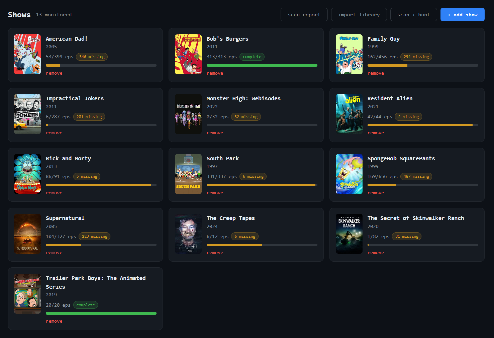
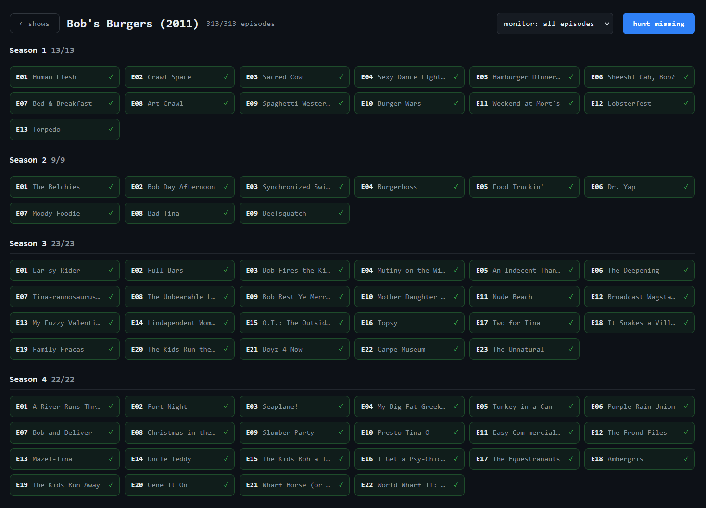
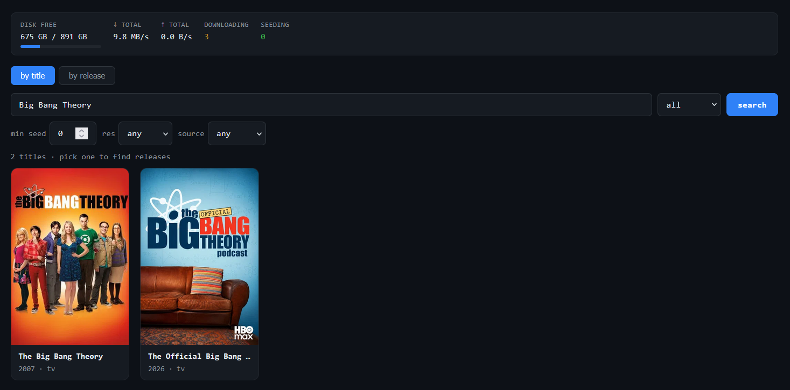

<div align="center">

# 💧 Faucet

**A complete self-hosted media manager — search, grab, sort, and track your shows and movies — in one lightweight app.**

Sonarr + Radarr + a download manager, without the five-container stack. One service over your indexer and torrent client, with a clean web UI.

[](https://github.com/Harrsn/faucet/actions/workflows/ci.yml)
[](LICENSE)


</div>

---

## What it does

Faucet manages the whole lifecycle of your media library from a single page. Search your indexers and grab a release, and Faucet hands it to your torrent client, watches it download, then renames and files it into a clean Plex/Jellyfin layout. Beyond one-off downloads, it tracks your library the way Sonarr and Radarr do: monitor a show, and Faucet knows every episode that exists, sees what you already have on disk, and hunts only what's missing. Point it at an existing library and it imports everything automatically.

It runs as one container over Jackett (or Prowlarr) and your torrent client. No Prowlarr + Sonarr + Radarr + a request frontend — just one app and minimal moving parts.

> **Heads up:** Faucet manages your own downloads. You are responsible for what you download and for complying with the law where you live.

## Features

### Library management (the Sonarr/Radarr core)

- **Monitored shows** — add a show and Faucet pulls its full episode list from TMDb, scans your library for what you own, and tracks the rest. A per-show detail view lays out every season and episode as have, missing, or unaired, with detected quality.
- **Monitored movies** — the Radarr side: add a movie, Faucet checks whether it's already in your library and grabs it if not. Movie detail view shows the file you have plus TMDb metadata, with a search-releases button.
- **Library auto-import** — point Faucet at an existing library and it discovers every show and movie on disk, matches each to TMDb, and creates monitored entries automatically. No adding hundreds of titles by hand.
- **Reconciliation** — diffs what *should* exist (canonical episode lists) against what you *have* (the library scan) to compute exactly what's missing, plus quality upgrades when you own something below your profile's target resolution.
- **Robust matching** — handles the messy reality of real libraries: release tags (`[1080p]`, `[BDRip]`), punctuation (`Bob's Burgers` vs `Bobs Burgers`), franchise entries, and truncated movie folders (`The Chronicles of Narnia` to the full subtitled TMDb title), disambiguated by year.

### Hunting

- **Automatic background hunting** — a built-in scheduler scans the library, reconciles every monitored show and movie, and grabs what's missing on a timer (default every 30 minutes). No extra container or cron job.
- **Season-pack preference** — when two or more episodes of a season are wanted, Faucet grabs a single season pack instead of many individual episodes: one client slot, many episodes, better seeded.
- **Concurrency caps** — never floods your client. Won't start hunting if too many torrents are already downloading, and grabs only a few per cycle; the rest stay queued for the next tick. Tunable via `HUNT_MAX_ACTIVE` / `HUNT_MAX_PER_RUN`.
- **Per-show monitor modes** — `all` (hunt every missing episode), `future` (only new episodes from the add date forward — ignore a huge back catalog), or `paused`. Keeps big shows from trying to backfill hundreds of episodes.
- **Quality profiles** — define preferred resolutions and sources in priority order, minimum seeders, and size caps. Releases are scored and the best match wins; profiles drive both search ranking and upgrade decisions.

### Search and download

- **Unified search** across every indexer Jackett or Prowlarr exposes, ranked by seeders, with type and quality badges (1080p · WEB-DL · MKV) and content classification (movie / TV / game).
- **Title search with posters** — search by title via TMDb, see posters, and drill into releases.
- **Any client** — Transmission, qBittorrent, or Deluge. Same UI, one env var to switch. Handles indexer redirects so `.torrent` URLs that 302 to magnets just work.
- **Auto-grab subscriptions** — follow a search query and Faucet grabs matching new releases on a timer, with de-duplication so nothing is grabbed twice.

### Library and UI

- **Auto-sort** — finished downloads are renamed and filed into `movies/` and `tvshows/` (`Show/Season 01/Show - S01E03.mkv`) with `guessit`. Games and disc/archive releases route to their own folders.
- **Live activity** — disk free, total speed, active and seeding counts, per-torrent progress with pause / resume / remove, an events feed, and download history with stats.
- **Scan report** — a diagnostic view of library files that couldn't be matched to a show or movie, with the reason, so naming issues and stray files are visible instead of silently skipped.
- **Nav-bar web UI** — proper pages for Search, Shows, Movies, Auto-grab, and Profiles, with an activity drawer and a settings panel. Dark/light themes and accent presets.
- **Notifications** — Discord, Telegram, ntfy, Gotify, or any webhook, on the events you choose.

## Screenshots

<!-- Replace with real captures: docs/screenshot-shows.png etc. -->
| Shows library | Show detail | Search |
|---|---|---|
|  |  |  |

## Quickstart (Docker)

```bash
git clone https://github.com/Harrsn/faucet.git
cd faucet
cp .env.example .env        # set JACKETT_API_KEY (and client creds if not default)
docker compose up -d
```

Open **http://localhost:8088**.

The compose stack bundles **Jackett** (add your indexers at `:9117`) and **Transmission** so it works out of the box. Already running your own? Delete that service from `docker-compose.yml` and point the env vars at yours.

### First run

1. Open Jackett at `http://localhost:9117`, add a few indexers, and copy the **API key**.
2. Open Faucet, go to **Settings**, and paste your Jackett key and your **TMDb API key** (free from [themoviedb.org](https://www.themoviedb.org) — needed for title search, posters, and episode tracking).
3. Go to **Shows** or **Movies** and hit **import library** to auto-monitor everything already on disk, or **add** individual titles. Faucet scans, reconciles, and starts filling gaps.

## Bare-metal

```bash
pip install -e .
cp .env.example .env        # fill in URLs + key
set -a; . ./.env; set +a
uvicorn faucet.app:app --host 0.0.0.0 --port 8088
```

Wire the completion hook in your client to run `python -m faucet.hook` so finished downloads get sorted — see [docs/HOOKS.md](docs/HOOKS.md) for per-client setup.

## Configuration

All via environment / `.env`:

| Variable | Default | Purpose |
|---|---|---|
| `JACKETT_API_KEY` | — | **Required.** Indexer API key. |
| `JACKETT_URL` | `http://127.0.0.1:9117` | Jackett/Prowlarr base URL. |
| `JACKETT_INDEXER` | `all` | Which indexer to query (`all` aggregates). |
| `DOWNLOAD_CLIENT` | `transmission` | `transmission` \| `qbittorrent` \| `deluge`. |
| `CLIENT_URL` | Transmission RPC | Client web/RPC endpoint. |
| `CLIENT_USER` / `CLIENT_PASS` | — | Client credentials. |
| `LIBRARY_ROOT` | `/library` | Library root (`tvshows/`, `movies/`). |
| `DOWNLOAD_DIR` | `/downloads` | Active download dir. |
| `DISK_PATH` | `/downloads` | Path used for the disk-free gauge. |
| `REMOVE_ON_COMPLETE` | `0` | Remove finished torrents (stops seeding). |
| `HUNT_MAX_ACTIVE` | `5` | Skip hunting if this many torrents are already downloading. |
| `HUNT_MAX_PER_RUN` | `3` | Max grabs per scheduler tick. |
| `RSS_INTERVAL_SECONDS` | `1800` | How often the scheduler scans/reconciles/hunts. |
| `SEARCH_LIMIT` | `150` | Max results per search. |
| `NOTIFY_URLS` | — | Comma-separated notification targets. |
| `NOTIFY_ON` | `completed,sorted,failed` | Which events notify. |
| `UI_THEME` / `UI_ACCENT` | `dark` / `blue` | Appearance. |

The TMDb API key is set in-app under **Settings** (stored in the database, not an env var). Full list and notification URL formats are in [.env.example](.env.example).

## Library tidy tool

Normalize existing season folders to `Season NN` and merge scattered duplicates:

```bash
python -m faucet.libtidy                 # dry-run, shows the plan
python -m faucet.libtidy --tv --apply    # execute TV renames
```

## How it compares

Faucet covers the same ground as a Prowlarr + Sonarr + Radarr + download-client stack — monitored library tracking, episode-level reconciliation, season-pack-aware hunting, quality profiles, and auto-import — but as a single service with one config and one container. It trades some of Sonarr/Radarr's depth (no per-season toggles yet, single metadata source) for radically fewer moving parts. If you want a single pane of glass for your library without running and updating four or five separate services, that's the niche.

## Contributing

Issues and PRs welcome. `pytest -q` runs the suite. New client backends just implement `faucet/clients/base.py`'s `DownloadClient` interface.

## License

MIT — see [LICENSE](LICENSE).
